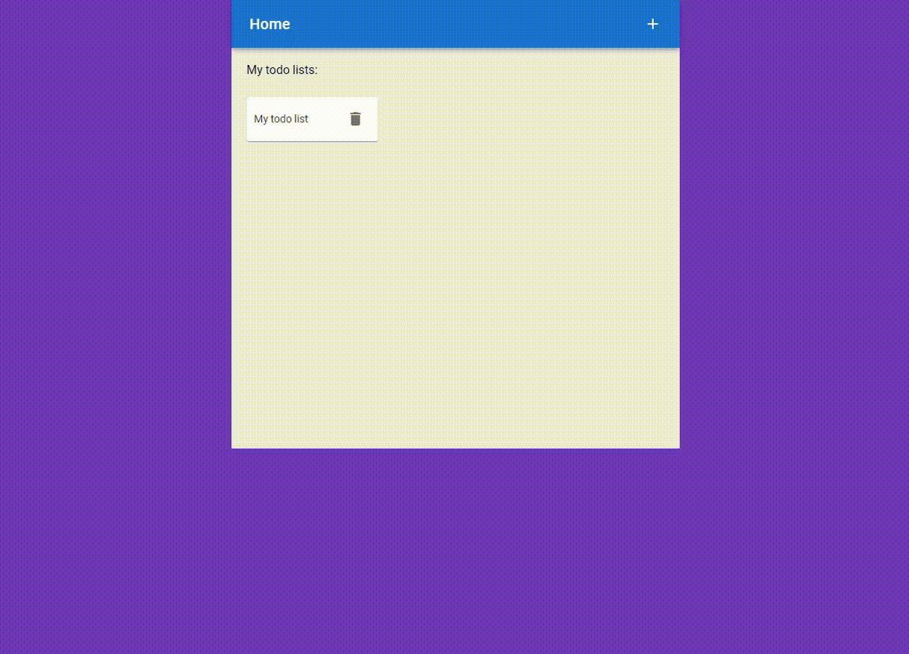

# Todo app



This is an simple app built in React to create todo lists. It supports these use cases:

- create, update and remove a todo list
- add, edit and remove todo items within a todo list
- view todo lists at home page
- filter todo items by text and by status properties

This app was also tested on Iphone 12 and ran pretty good.

## Install

clone the repo and then run these commands in the root directory

```
npm install
npm run start-server
```

## Stack

Several technologies were used to build this app. For data management I used [MobX](https://mobx.js.org/README.html). It uses
[ReactRouter](https://reactrouter.com/en/main) for page navigation. For styling of components I used mix of my custom components with scss
styling and also [MaterialUI](https://mui.com/core/) components. Forms are built using [Formik](https://formik.org/docs/api/formik) and
validated using [Yup](https://www.npmjs.com/package/yup). Data are accesed from [MockAPI](https://mockapi.io/) endpoint.
